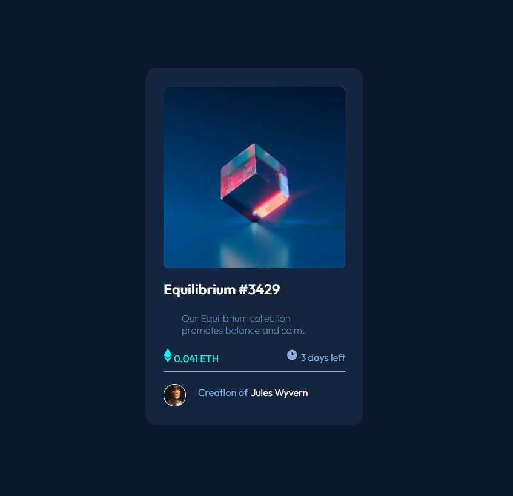

# Frontend Mentor - NFT preview card component solution

This is a solution to the [NFT preview card component challenge on Frontend Mentor](https://www.frontendmentor.io/challenges/nft-preview-card-component-SbdUL_w0U). Frontend Mentor challenges help you improve your coding skills by building realistic projects. 

## Table of contents

- [Overview](#overview)
  - [The challenge](#the-challenge)
  - [Screenshot](#screenshot)
  - [Links](#links)
- [My process](#my-process)
  - [Built with](#built-with)
  - [What I learned](#what-i-learned)
  - [Continued development](#continued-development)
- [Author](#author)
- [Acknowledgments](#acknowledgments)

**Note: Delete this note and update the table of contents based on what sections you keep.**

## Overview

### The challenge

Users should be able to:

- View the optimal layout depending on their device's screen size
- See hover states for interactive elements

### Screenshot

### Links

- Solution URL: [Add solution URL here](https://github.com/Jioh19/nft-preview-card-component-main)
- Live Site URL: [Add live site URL here](https://jioh19.github.io)

### Built with

- Semantic HTML5 markup
- CSS 
- Flexbox

### What I learned

Learned how to use Flexbox. Still novice level. Practicing and learning HTML CSS

### Continued development

Keep polishing my skills doing more excercises.

## Author

- Frontend Mentor - [@yourusername](https://www.frontendmentor.io/profile/Jioh19)

## Acknowledgments

Gracias a Talento digital Javascript Fullstack por enseñarme lo basico y empezar con algo

